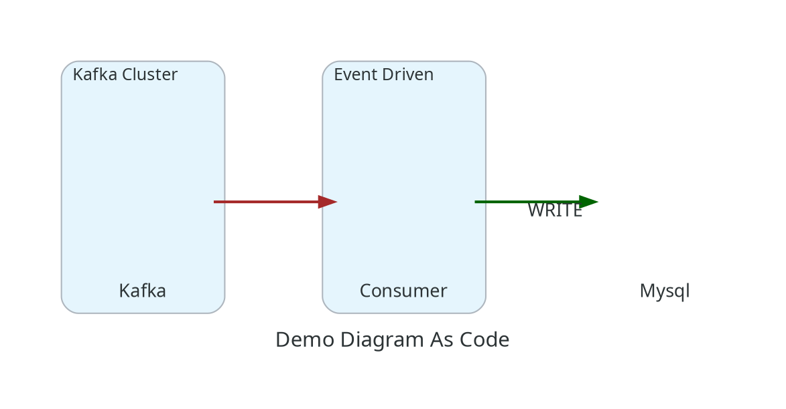
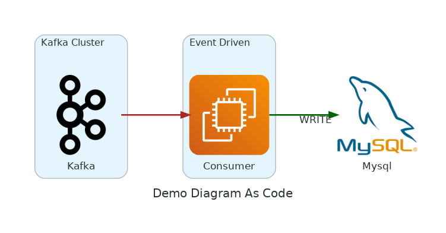

# diagram-as-code

## Installation
```bash
composer require nddcoder/diagram-as-code
```

## Usage

Create a `demo.php` and return `Diagram` instance

```php
<?php

use Nddcoder\Dac\Base\Cluster;
use Nddcoder\Dac\Base\Diagram;
use Nddcoder\Dac\Base\Style\Color;
use Nddcoder\Dac\Base\Style\EdgeStyle;
use Nddcoder\Dac\Base\Style\Style;
use Nddcoder\Dac\Diagram\Aws\Compute\Ec2;
use Nddcoder\Dac\Diagram\Onprem\Database\Mysql;
use Nddcoder\Dac\Diagram\Onprem\Queue\Kafka;

return Diagram::create('G', 'Demo Diagram As Code')
    ->direction(Style::DIR_LR)
    ->append(
        Cluster::create('kafka', 'Kafka Cluster')
            ->append($kafka = Kafka::create('kafka', 'Kafka'))
    )
    ->append(
        Cluster::create('event_driven', 'Event Driven')
            ->append($consumer = Ec2::create('consumer', 'Consumer'))
    )
    ->append($database = Mysql::create('mysql', 'Mysql'))
    ->connect($kafka, $consumer, EdgeStyle::create()->style(Style::BOLD)->color(Color::BROWN))
    ->connect($consumer, $database, EdgeStyle::create()->style(Style::BOLD)->color(Color::DARKGREEN)->label('WRITE'));
```

Run `dac` command to build `dot` config

```bash
vendor/bin/dac demo.php
```

Dot config output



### Generate PNG file

Using Docker

```bash
vendor/bin/dac --root=/dot/vendor/nddcoder/diagram-as-code demo.php | docker run --rm -i -v $(pwd):/dot nshine/dot > demo.png
```

Use `dot` command from `graphviz`.

```bash
vendor/bin/dac demo.php | dot -Tpng > demo.png
```

### PNG Output



## Sample

* [examples/00-readme.php](examples/00-readme.php): example from README
* [examples/01-more-complex.php](examples/01-more-complex.php): more complex example
